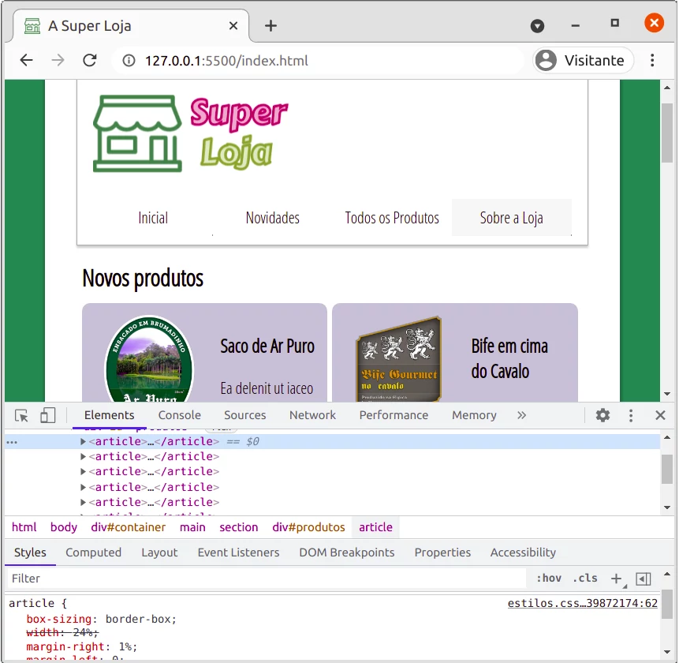

<!-- {"layout": "title"} -->
# A **Super** Loja :convenience_store:
## Lojinha responsível

- Atividade de hoje

---

<video src="//willsallum.github.io/cefet_front_end_large_assets/videos/super-store.webm" loop="-1" controls id="super-store"></video> 

---

Vendendo o que você não quer comprar desde 2017. Baixe os [arquivos aqui][baixar].
O resultado final deve se parecer com isto aqui, em um dispositivo
com a tela menor:


[baixar]: https://github.com/willsallum/cefet_front_end_store/archive/main.zip


## Exercício 0: Definindo a **_viewport_**

Se uma página não define "quanto de largura" ela pretende usar, o navegador
de dispositivos menores supõe que ela quer aproximadamente uns 1024px.
Aí, o navegador acaba informando à página que ela pode ter todos esses
pixels de largura, renderiza (ie, desenha) a página e é bem provável
que ele precise fazer um _"zoom out"_ pra conseguir mostrar tudo.

É possível interagir com a página, fazendo _"zoom in"_ e _"panning"_
(navegando para os lados), mas isso não é uma boa para o usuário.

Para evitar que isso aconteça, podemos instruir o navegador pra falar
que pretendemos desenhar a página usando apenas X pixels de largura.
Defina a janela de pintura (_viewport_) da página como tendo a mesma largura
que a largura do dispositivo (computador, celular etc.), não mais, não menos.
Veja [como definir a _viewport_ nos slides][viewport].

Para saber se deu certo, veja no [FAQ](#faq) como usar as ferramentas do
desenvolvedor pra simular que a página está sendo acessada por um celular.


## Exercício 1: _Breakpoints_ para 3, 2 e 1 produto por linha

**Repare** que os produtos (`<article></article>`) possuem `width: 24%`
e `margin-right: 1%`, de forma que 4 produtos são exibidos por linha.

Usando a ferramenta do desenvolvedor para alterar a largura
(como no [FAQ](#faq)), encontre um valor de largura **da janela** que,
desse valor para baixo (digamos, 1024px), você deve (a) criar uma
_media query_ para **colocar 3 produtos por linha**.

Depois, crie (b) outra _media query_, a partir de um valor menor de largura
da tela para **colocar 2 produtos por linha**.

Por fim, (c) para larguras menores que 400px, crie uma _media query_ para
mostrar apenas **01 produto por linha**.


## Exercício 2: Movendo `<aside>` para baixo

Na largura que você definiu (no exercício 1) para mostrar 2 produtos
por linha, faça com que o `<aside></aside>` (de inscrever e-mail)
apareça abaixo da `<section></section>` dos produtos, mas
antes do `<footer></footer>`. Para tanto, basta mudar a direção da
_flexbox_ do `<main></main>` (pai do `<section>` e do `<aside>`) para
ser uma coluna, usando:

```css
main {
  flex-direction: column;
}
```


## Exercício 3: Menu vertical

Na mesma largura do exercício anterior, faça com que o menu principal
(`#menu-principal`) seja mostrado com cada item em uma linha (ou seja,
altere a direção _flex_ para funcionar como uma coluna - assim como
foi feito no exercício anterior.


## Desafio 1: Menu hamburguer

Em vez de apenas mostrar o menu na vertical, em larguras pequenas,
faça aparecer um "botão hamburguer" (aquele ícone de 3 linhas) que,
quando clicado, faz o menu surgir da esquerda para a direita, com
posicionamento fixo. Isso pode ser [similar ao menu lateral][menu-lateral]
que vimos em outra aula.

É possível fazer isso com _media queries_ + um código JavaScript
para colocar/remover uma classe para mostrar/ocultar o menu.


## FAQ


### Simulando acesso por celular

As ferramentas do desenvolvedor possuem um recurso de simulação de
dispositivos como celulares e _tablets_. Para ativar esse recurso:



### O que é _media query_?

É um recurso do CSS que serve para fazer uma ou mais regras CSS
se aplicarem apenas em determinadas situações, por exemplo, apenas
em dispositivos com telas com uma largura máxima igual a 320px.

### Como criar uma _media query_?

Dentro de um arquivo CSS, você pode criar uma regra `@media` assim:

```css
.postagem {
  display: inline-block;
  width: 50%;
}

/* aqui vamos definir uma media query
   pra fazer com que, em telas pequenas (< 600px),
   cada postagem vai ocupar 100% da largura disponível */
@media (max-width: 600px) {
  .postagem {
    width: 100%;
  }
}
```

[viewport]: https://willsallum.github.io/cefet_front_end/classes/css7/#a-tag-meta-viewport
[menu-lateral]: https://willsallum.github.io/cefet_front_end/classes/js2/#menu-lateral
